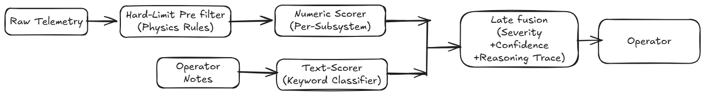

# Spacecraft Telemetry Health Assessment


Per-pass telemetry from a 3U–6U CubeSat-class LEO satellite, plus the operator's
free-text note, go in; a severity-graded health assessment with an auditable
reasoning trace comes out. **This is decision support, not autonomous flight
software — a human operator confirms every action.**

## Architecture




- **Hard limits run first** and are never overridable — if a fixed physics rule fires, the verdict is CRITICAL regardless of any model or note.
- **Numeric and text are scored independently**, then combined by *late fusion* (take the higher severity; confidence = the lower of the two). A reassuring note can never mask a genuine telemetry anomaly.
- **Four severity bands:** NOMINAL → WATCH → CAUTION → CRITICAL, each with a visible confidence indicator so genuinely uncertain passes are surfaced for human review rather than given a falsely confident label.

## Quick Start

```bash
pip install -r requirements.txt

# 1. Generate synthetic nominal telemetry  -> data/generated/nominal_passes.json
python data/synthetic_generator.py

# 2. Inject labelled anomalies             -> labelled_passes.json, labels.json, demo_passes.json
python data/anomaly_injection.py

# 3. Train the per-subsystem models        -> data/generated/trained_models.pkl
python pipeline/numeric_scoring.py

# 4. Run the operator UI
streamlit run ui/app.py
```

> Steps 1–3 build the data and models the UI loads. Run them once (in order)
> before launching the app; re-run them only if you change the generator,
> injector, or scorer.

## Reproduce the results

Every number in the report is produced by a script you can re-run:

```bash
# Validation & metrics — hard-limit layer, per-subsystem P/R/F1, calibration (Step 10)
python tests/validation_metrics.py

# Architecture experiments (Step 9)
python experiments/fusion_topology_compare.py   # late vs early fusion
python experiments/granularity_compare.py        # windowed vs point-in-time
python experiments/deep_learning_compare.py      # classical vs LSTM-Autoencoder (EPS)

# Single self-contained demo of all three experiments (used in the live demo)
python experiments/arch_comparison_cli.py

# Hard-limit rule tests
python tests/test_hard_limits.py
python tests/validate_hard_limits.py
```

## Project Structure

```
telemetry-health/
├── data/                          # Synthetic data generation
│   ├── synthetic_generator.py     # per-pass telemetry (eclipse-driven physics)
│   ├── anomaly_injection.py       # point / contextual / trend / hard-limit injector
│   └── generated/                 # nominal_passes, labelled_passes, labels, trained_models.pkl
├── pipeline/                      # Core assessment pipeline
│   ├── hard_limits.py             # independent physics rule engine (always wins)
│   ├── numeric_scoring.py         # Isolation Forest / One-Class SVM, envelope-distance scoring
│   ├── text_scoring.py            # keyword/phrase operator-note classifier
│   ├── fusion.py                  # late fusion (higher severity, min confidence) + reasoning trace
│   └── severity.py                # four-level severity bands
├── experiments/                   # Architecture-level comparisons (Step 9)
│   ├── fusion_topology_compare.py
│   ├── granularity_compare.py
│   ├── deep_learning_compare.py
│   └── arch_comparison_cli.py     # combined CLI demo of all three
├── ui/
│   └── app.py                     # Streamlit operator interface
├── tests/                         # Unit tests + validation metrics
│   ├── test_hard_limits.py
│   ├── validate_hard_limits.py
│   └── validation_metrics.py # 5–7 minute live demo script
├── requirements.txt
└── README.md
```
